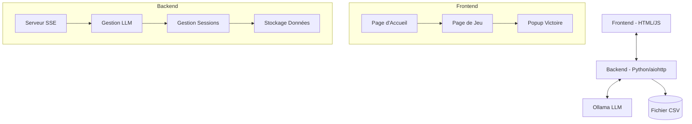
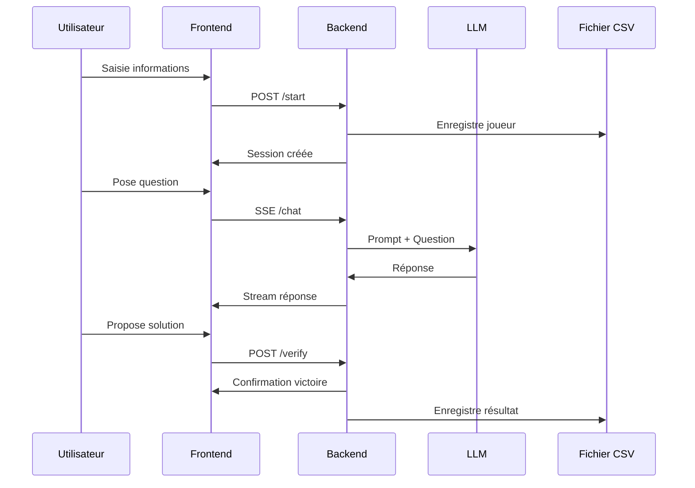

# Architecture du Jeu de Devinette

## Vue d'ensemble
Ce document décrit l'architecture d'un jeu de type "Qui est-ce?" où les joueurs interagissent avec une IA pour deviner un mot caché.

## Architecture Globale



## Structure du Projet
```
word-guessing-game/
├── backend/
│   ├── main.py           # Point d'entrée de l'application
│   ├── routes.py         # Routes API
│   ├── game_manager.py   # Gestion du jeu
│   ├── llm_client.py     # Interface avec Ollama
│   └── data_manager.py   # Gestion des données CSV
├── frontend/
│   ├── index.html        # Page d'accueil
│   ├── game.html         # Page de jeu
│   ├── css/
│   │   └── styles.css
│   └── js/
│       ├── main.js       # Logic principale
│       └── chat.js       # Gestion du chat
└── data/
    └── game_results.csv  # Stockage des résultats
```

## Flux de Données



## Spécifications Techniques

### Backend (Python/aiohttp)
- **Routes principales** :
  - POST `/start` : Démarrage partie
  - GET `/stream` : SSE pour le chat
  - POST `/verify` : Vérification réponse
  - POST `/end` : Fin de partie

### Prompt System LLM
```
Tu est une IA qui joue à un jeu de devinette.
Je vais te donner un mot, et le joueur devra te poser des questions pour deviner ce mot.
Si c'est une question fermée, tu répondra par oui ou non.
Si c'est une question ouverte, tu répondra par une phrase mais tu ne donnera jamais une description complète du mot.    

NE DONNE JAMAIS LE MOT EN ENTIER.
```

### Stockage des Données
Format CSV :
```csv
date,nom,prenom,email,mot_cache,resultat,temps_partie
```

### Sécurité
- Validation des entrées utilisateur
- Protection CSRF
- Sanitization des données

### Démarrage Application
```bash
python main.py --word "mot_secret" --output "resultats.csv"