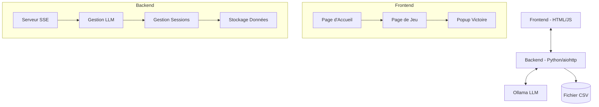
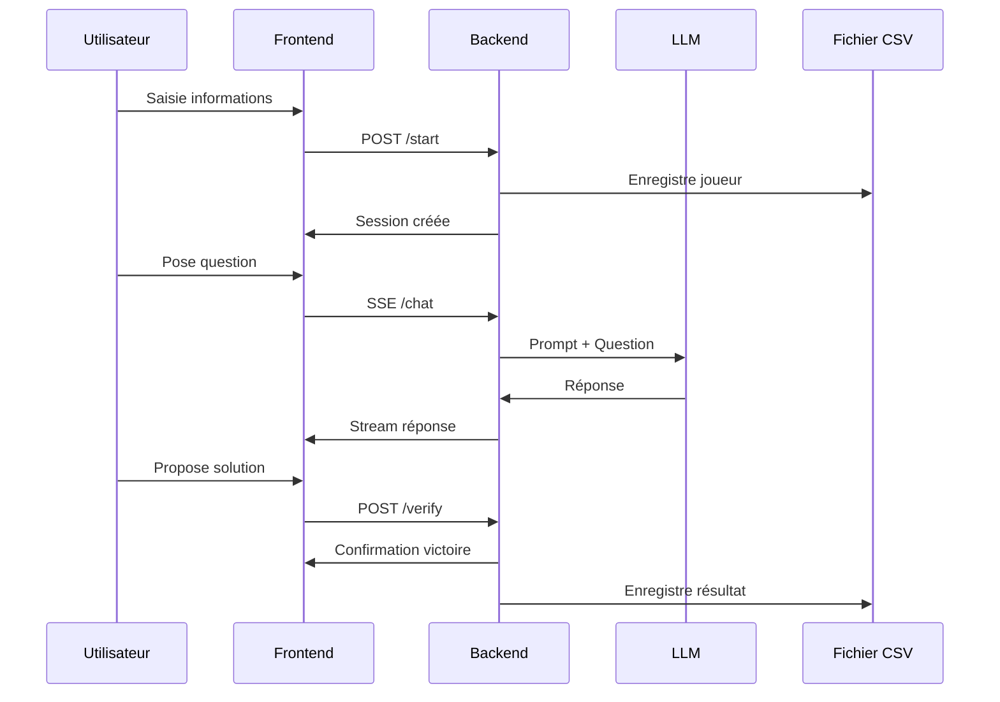

# Architecture du Jeu de Devinette

## Vue d'ensemble
Ce document décrit l'architecture d'un jeu de type "Qui est-ce?" où les joueurs interagissent avec une IA pour deviner un mot caché.

## Architecture Globale



## Structure du Projet
```
defeat-the-prompt/
├── backend/
│   ├── main.py           # Application principale (routes, gestion du jeu, LLM)
│   └── templates/        # Templates (si nécessaire)
├── frontend/
│   ├── index.html        # Page d'accueil
│   ├── game.html         # Page de jeu avec logique JavaScript intégrée
│   └── css/
│       └── styles.css    # Styles de l'application
└── data/
    └── resultats.csv    # Stockage des résultats de jeu
```

## Flux de Données



## Spécifications Techniques

### Backend (Python/aiohttp)
- **Routes principales** :
  - GET `/` : Page d'accueil
  - GET `/game` : Page de jeu
  - POST `/start` : Démarrage partie
  - GET `/stream` : Configuration SSE
  - POST `/stream` : Envoi des messages au LLM
  - POST `/verify` : Vérification réponse
  - GET `/static/*` : Fichiers statiques

### Système LLM
- **Modèle** : Configurable via Ollama (par défaut: llama3.2:3b)
- **Configuration** : Le modèle peut être spécifié au démarrage via l'argument `--model`
- **Prompt System** :
```
Tu est une IA qui joue à un jeu de devinette.
Le joueur doit deviner un mot en posant des questions.
Le mot à deviner est '{mot_caché}'.

Historique de la conversation:
<historique>
{historique_questions_reponses}
</historique>

Le joueur dit:
<message>
{question}
</message>

<instructions>
Si c'est une question fermée, réponds par oui ou non.
Si c'est une question ouverte, réponds par une phrase.
Ne donne JAMAIS une description complète du mot.
NE DONNE JAMAIS LE MOT EN ENTIER.
</instructions>

Base ta réponse en tenant compte de l'historique des questions précédentes.
```

### Stockage des Données (resultats.csv)
Format CSV :
```csv
date,nom,prenom,email,mot_cache,resultat,temps_partie
```

États possibles du résultat :
- 'en_cours' : Partie en cours
- 'victoire' : Mot trouvé (TODO: à implémenter)
- 'abandon' : Partie abandonnée (TODO: à implémenter)

### Sécurité
- Validation des entrées utilisateur
- Protection CSRF
- Sanitization des données

### Démarrage Application
```bash
python backend/main.py --word "mot_secret" --output "data/resultats.csv" [--model "nom_du_modele"]
```

### Fonctionnalités à Implémenter
1. Mise à jour du CSV avec le résultat de la partie (victoire/abandon)
2. Calcul et enregistrement du temps de partie
3. Route POST `/end` pour l'abandon de partie