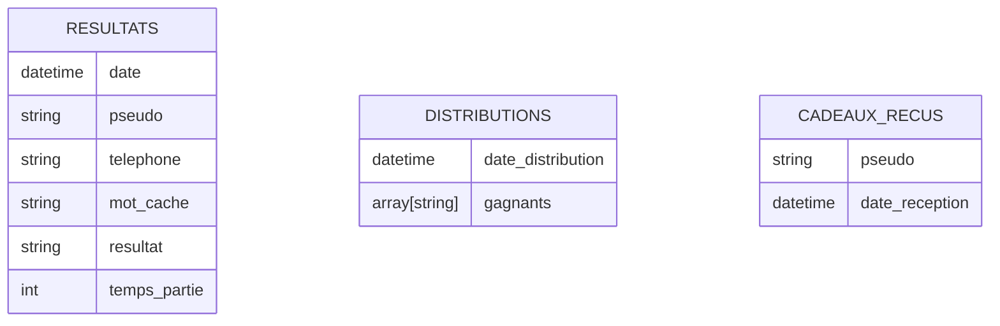
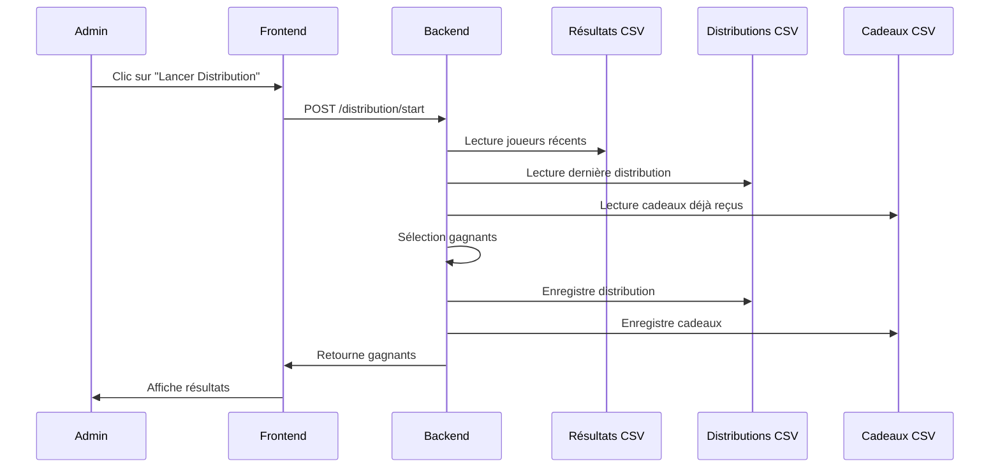
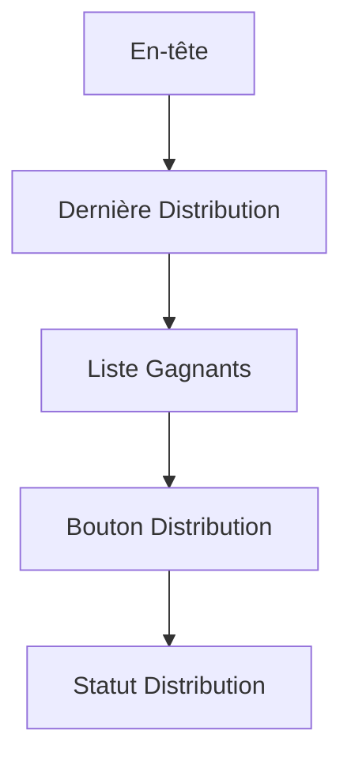

# Implémentation du Système de Distribution de Cadeaux

## Vue d'ensemble
Le système de distribution de cadeaux permet de sélectionner automatiquement 3 joueurs toutes les 12 heures parmi ceux qui ont participé au jeu. Le processus de sélection suit une logique prioritaire pour récompenser les performances tout en maintenant un aspect équitable.

## Stockage des Données

### Structure des données



### Format des fichiers CSV

Distributions (data/distributions.csv):
```csv
date_distribution,gagnant1,gagnant2,gagnant3
```

Cadeaux reçus (data/cadeaux_recus.csv):
```csv
pseudo,date_reception
```

## Architecture du Système

### Flux de données



## Modifications Backend

### Nouvelles Routes API

- `GET /distribution/last` : Récupère les informations sur la dernière distribution
- `POST /distribution/start` : Déclenche une nouvelle distribution
- `GET /distribution/winners` : Liste les gagnants de la dernière distribution

### Logique de Sélection

```python
def select_winners(last_distribution_date):
    # 1. Récupérer joueurs depuis dernière distribution
    recent_players = get_players_since(last_distribution_date)
    
    # 2. Trier gagnants par temps
    winners = sorted(
        [p for p in recent_players if p.resultat == 'victoire'],
        key=lambda x: x.temps_partie
    )[:3]
    
    # 3. Si pas assez de gagnants, compléter avec perdants aléatoires
    if len(winners) < 3:
        losers = random.sample(
            [p for p in recent_players if p not in winners],
            3 - len(winners)
        )
        winners.extend(losers)
    
    # 4. Si toujours pas assez, prendre des anciens joueurs
    if len(winners) < 3:
        previous_players = get_players_without_gifts()
        winners.extend(
            random.sample(previous_players, 3 - len(winners))
        )
    
    return winners
```

## Interface Frontend

### Page de Distribution (distribution.html)



### Éléments d'Interface
1. Affichage de la date/heure de dernière distribution
2. Liste des derniers gagnants avec leurs informations
3. Bouton pour déclencher une nouvelle distribution
4. Indicateur visuel du statut de la distribution

## Plan d'Intégration

1. Modifications du système de navigation
   - Ajout d'un lien "Distribution de Cadeaux" dans le menu principal
   - Restriction d'accès à la page aux administrateurs

2. Mise à jour du modèle de données
   - Ajout des nouveaux fichiers CSV
   - Mise à jour des scripts de maintenance

3. Documentation
   - Ajout de la documentation technique
   - Guide d'utilisation pour les administrateurs

## Sécurité

1. Validation des accès administrateur
2. Protection contre les distributions multiples
4. Journalisation des actions de distribution

## Tests

1. Tests unitaires pour la logique de sélection
2. Tests d'intégration pour les nouvelles routes
3. Tests de charge pour la génération de distributions
4. Tests de sécurité pour l'accès administrateur