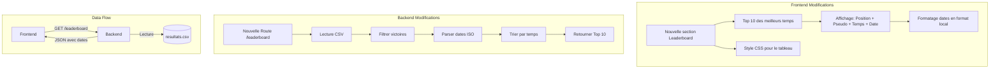

# Implémentation du Leaderboard

## Vue d'ensemble
Cette spécification décrit l'ajout d'un tableau des meilleurs scores (leaderboard) au jeu "Defeat the prompt". Le leaderboard affichera les 10 meilleures performances des joueurs ayant réussi à deviner le mot.

## Architecture



## Modifications Backend

### Nouvelle Route API
- **Route**: `GET /leaderboard`
- **Description**: Retourne les 10 meilleurs scores
- **Format de réponse**:
```json
{
  "leaderboard": [
    {
      "position": 1,
      "pseudo": "joueur1",
      "temps": 20,
      "date": "2025-04-13T19:40:35.378189"
    }
  ]
}
```

### Traitement des Données
1. Lecture du fichier resultats.csv
2. Filtrage des entrées avec resultat = 'victoire'
3. Tri par temps_partie croissant
4. Limitation aux 10 meilleurs scores
5. Formatage de la réponse JSON

## Modifications Frontend

### Ajout dans index.html
```html
<section class="leaderboard">
    <h2>Les Champions</h2>
    <table id="leaderboardTable">
        <thead>
            <tr>
                <th>#</th>
                <th>Pseudo</th>
                <th>Temps</th>
                <th>Date</th>
            </tr>
        </thead>
        <tbody>
            <!-- Rempli dynamiquement par JavaScript -->
        </tbody>
    </table>
</section>
```

### Styles CSS
Ajouts dans `frontend/css/styles.css`:
```css
.leaderboard {
    margin: 2rem 0;
    padding: 1rem;
    background: #f5f5f5;
    border-radius: 8px;
}

.leaderboard table {
    width: 100%;
    border-collapse: collapse;
}

.leaderboard th,
.leaderboard td {
    padding: 0.5rem;
    text-align: left;
    border-bottom: 1px solid #ddd;
}

.leaderboard th {
    background: #007bff;
    color: white;
}

.leaderboard tr:nth-child(even) {
    background: #f9f9f9;
}
```

### JavaScript
```javascript
function formatTemps(seconds) {
    const minutes = Math.floor(seconds / 60);
    const remainingSeconds = seconds % 60;
    return `${minutes.toString().padStart(2, '0')}:${remainingSeconds.toString().padStart(2, '0')}`;
}

function formatDate(isoDate) {
    return new Date(isoDate).toLocaleString('fr-FR', {
        day: '2-digit',
        month: '2-digit',
        year: '2-digit',
        hour: '2-digit',
        minute: '2-digit'
    });
}

async function updateLeaderboard() {
    try {
        const response = await fetch('/leaderboard');
        const data = await response.json();
        
        const tbody = document.querySelector('#leaderboardTable tbody');
        tbody.innerHTML = data.leaderboard.map(entry => `
            <tr>
                <td>${entry.position}</td>
                <td>${entry.pseudo}</td>
                <td>${formatTemps(entry.temps)}</td>
                <td>${formatDate(entry.date)}</td>
            </tr>
        `).join('');
    } catch (error) {
        console.error('Erreur lors de la mise à jour du leaderboard:', error);
    }
}

// Mise à jour initiale et périodique
document.addEventListener('DOMContentLoaded', () => {
    updateLeaderboard();
    setInterval(updateLeaderboard, 30000);
});
```

## Test et Validation

### Critères de succès
1. Le leaderboard s'affiche correctement sur la page d'accueil
2. Les temps sont triés correctement (ordre croissant)
3. Les dates sont affichées au format local
4. La mise à jour automatique fonctionne toutes les 30 secondes
5. Le tableau reste responsive sur mobile

### Cas de test
1. Vérifier l'affichage avec 0 score
2. Vérifier l'affichage avec 1-9 scores
3. Vérifier l'affichage avec 10+ scores
4. Vérifier le formatage des temps (minutes:secondes)
5. Vérifier le formatage des dates
6. Tester la mise à jour automatique
7. Tester l'affichage sur différentes tailles d'écran

## Prochaines Étapes Potentielles
1. Ajout de filtres par période (jour/semaine/mois)
2. Mise en évidence des nouveaux records
3. Animation lors de la mise à jour des données
4. Statistiques supplémentaires (moyenne, médiane)