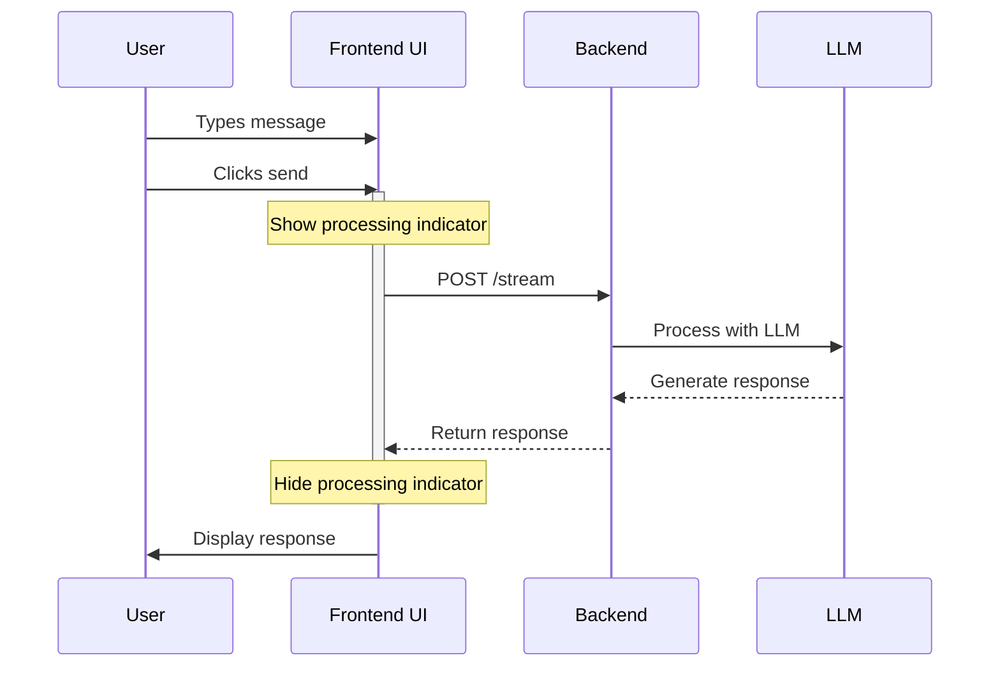

# Processing Indicator Implementation Plan

## Overview

This document outlines the plan for implementing a visual processing indicator when the model is generating a response.



## Technical Implementation Details

1. **Visual Component**
   - Add a new "processing" state indicator in the chat UI
   - Use a subtle animation to show activity
   - Position it within the chat message area
   - Match the existing design language

2. **UI State Management**
   - Add a processing state flag in the JavaScript code
   - Toggle this state when sending/receiving messages
   - Disable the send button during processing
   - Show visual feedback in the input area

3. **CSS Changes**
```css
.message.processing {
  display: flex;
  align-items: center;
  gap: 8px;
  background-color: #f8f9fa;
  margin-right: auto;
}

.processing-indicator {
  display: inline-block;
  width: 12px;
  height: 12px;
  border: 2px solid var(--primary-color);
  border-radius: 50%;
  border-top-color: transparent;
  animation: spin 1s linear infinite;
}

@keyframes spin {
  to { transform: rotate(360deg); }
}
```

4. **HTML Changes**
   - Add processing indicator template HTML
   - Update message container structure
   - Add aria labels for accessibility

5. **JavaScript Changes**
   - Add processing state management
   - Update message append logic
   - Add indicator show/hide logic
   - Handle errors appropriately

## File Changes Required

1. `frontend/game.html`:
   - Add processing indicator template
   - Update JavaScript event handlers
   - Add button disable state

2. `frontend/css/styles.css`:
   - Add new processing indicator styles
   - Add animation keyframes
   - Update message container styles

## Benefits

- Clear visual feedback during processing
- Improved user experience
- Matches existing design language
- Accessible to screen readers
- Mobile-responsive