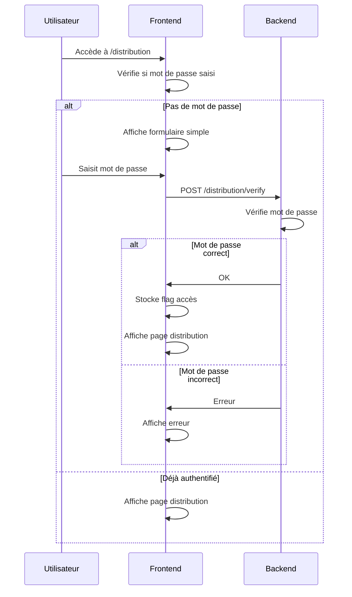

# Protection Simple de la Page de Distribution

## Vue d'ensemble
Implémentation d'une protection par mot de passe simple pour la page de distribution des cadeaux, avec mot de passe configurable au démarrage du serveur.

## Architecture



## Implémentation

### Backend
- Ajout d'un paramètre `--password` au démarrage du serveur
- Nouvelle route `POST /distribution/verify` qui vérifie le mot de passe

### Frontend
- Formulaire de saisie du mot de passe basique
- Stockage d'un flag `acces_distribution` en localStorage
- Redirection vers le formulaire si pas de flag

## Démarrage du Serveur
```bash
python backend/main.py --word "mot_secret" --output "data/resultats.csv" --password "mot_de_passe_admin"
```

## Étapes d'Implémentation

1. Backend:
   - Ajouter le paramètre password dans l'init de GameServer
   - Créer la route de vérification simple

2. Frontend:
   - Ajouter le formulaire de mot de passe
   - Gérer le stockage du flag d'accès
   - Rediriger si pas authentifié