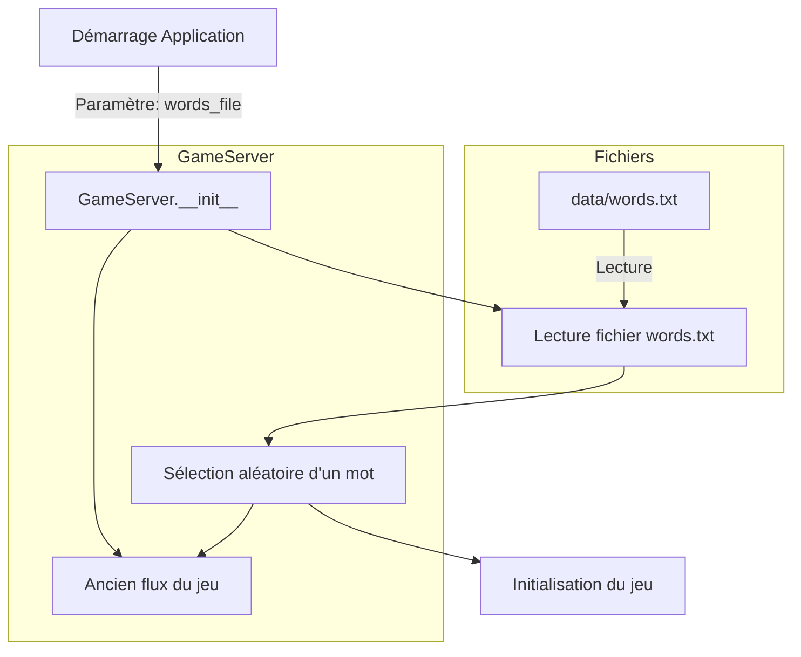

# Implémentation de la Sélection Aléatoire de Mots

## Vue d'ensemble
Cette modification permet de remplacer le paramètre `--word` qui spécifie un mot unique à deviner par un paramètre `--words-file` qui pointe vers un fichier contenant une liste de mots parmi lesquels un sera choisi aléatoirement au début de chaque partie.

## Structure

### Fichier de mots (data/words.txt)
```
voiture
maison
ordinateur
...
```

### Modifications du code

#### 1. Modification du constructeur GameServer

```python
def __init__(self, words_file: str, output_file: str, model_name: str, admin_password: str):
    self.model_name = model_name
    self.admin_password = admin_password
    self.conversation_history = []
    self.start_time = None
    self.current_pseudo = None
    
    # Charger et sélectionner un mot aléatoire
    self.hidden_word = self._select_random_word(words_file)
```

#### 2. Nouvelle méthode pour la sélection aléatoire

```python
def _select_random_word(self, words_file: str) -> str:
    try:
        with open(words_file, 'r', encoding='utf-8') as f:
            words = [word.strip().lower() for word in f if word.strip()]
        if not words:
            raise ValueError("Le fichier de mots est vide")
        return random.choice(words)
    except Exception as e:
        logger.error(f"Erreur lors du chargement du fichier de mots: {e}")
        raise
```

#### 3. Modification du script principal

```python
def main():
    parser = argparse.ArgumentParser()
    parser.add_argument('--words-file', required=True, 
                       help='Chemin vers le fichier contenant la liste des mots')
    parser.add_argument('--output', default='data/resultats.csv',
                       help='Fichier de sortie pour les résultats')
    parser.add_argument('--model', default='llama2:3b',
                       help='Nom du modèle Ollama à utiliser')
    parser.add_argument('--admin-password', required=True,
                       help='Mot de passe admin pour la distribution')
    
    args = parser.parse_args()
    
    app = GameServer(args.words_file, args.output, args.model, args.admin_password)
    web.run_app(app.app, port=8080)
```

## Validation et Gestion d'Erreurs

1. Vérification du fichier:
   - Existence du fichier words.txt
   - Permissions de lecture
   - Encodage UTF-8 valide

2. Validation du contenu:
   - Au moins un mot dans le fichier
   - Mots non vides après nettoyage
   - Conversion en minuscules

3. Gestion des erreurs:
   - FileNotFoundError : Le fichier n'existe pas
   - PermissionError : Pas de permission de lecture
   - UnicodeDecodeError : Problème d'encodage
   - ValueError : Fichier vide

## Flux d'exécution



## Utilisation

Pour lancer l'application avec le nouveau système:

```bash
python backend/main.py --words-file data/words.txt --output data/resultats.csv --model llama2:3b --admin-password votrepassword