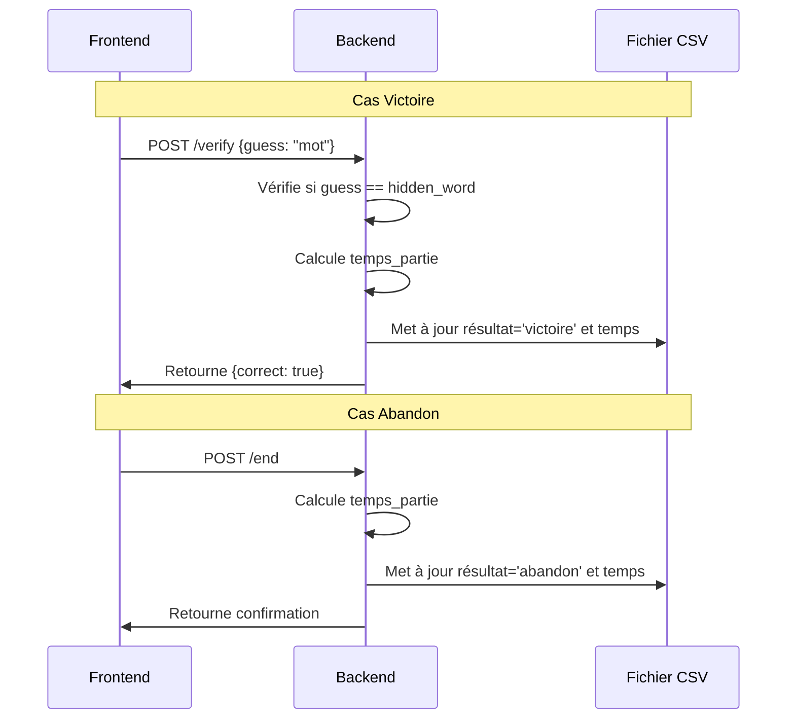

# Plan d'Implémentation du Stockage des Résultats

## Vue d'ensemble

Implémentation du stockage des résultats de parties dans le fichier CSV, incluant la gestion des états 'victoire' et 'abandon', ainsi que le calcul du temps de partie.

## Diagramme de séquence



## Modifications Requises

### 1. Backend (main.py)

#### Nouvelles Fonctionnalités

1. Attribut `start_time` dans GameServer
   ```python
   def __init__(self, hidden_word: str, output_file: str):
       self.start_time = None
       # ...
   ```

2. Méthode utilitaire pour mise à jour CSV
   ```python
   def _update_game_result(self, email: str, resultat: str) -> None:
       """
       Met à jour le résultat et le temps de la partie dans le CSV
       """
       temps_partie = (datetime.now() - self.start_time).seconds
       # Mise à jour dernière ligne du joueur
   ```

3. Mise à jour de handle_start()
   ```python
   async def handle_start(self, request):
       self.start_time = datetime.now()
       # ...
   ```

4. Mise à jour de handle_verify()
   ```python
   async def handle_verify(self, request):
       # Mise à jour résultat 'victoire'
       if guess == self.hidden_word:
           await self._update_game_result(email, 'victoire')
   ```

5. Nouvelle route /end
   ```python
   async def handle_end(self, request):
       # Gestion abandon partie
       await self._update_game_result(email, 'abandon')
   ```

### 2. Routes à Ajouter

```python
def setup_routes(self):
    # Routes existantes...
    self.app.router.add_post('/end', self.handle_end)
```

## Points d'Attention

1. Gestion des erreurs
   - Validation des données d'entrée
   - Gestion des exceptions lors de l'écriture CSV
   - Vérification de l'existence de la partie en cours

2. Performance
   - Optimisation des accès fichier CSV
   - Gestion mémoire pour l'historique des parties

3. Sécurité
   - Validation des entrées utilisateur
   - Protection contre les accès concurrents au CSV