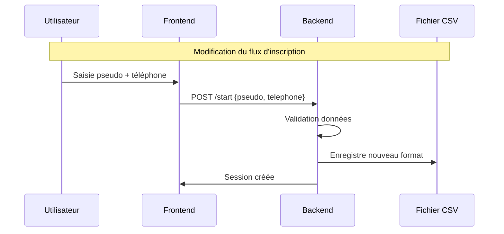

# Modification des Informations Joueur

## Vue d'ensemble
Modification des informations requises pour le joueur : remplacement des champs prénom, nom et email par un pseudo et un numéro de téléphone.

## Diagramme de Flux



## Modifications Techniques

### 1. Modification du Stockage (CSV)
- **Ancien format** : `date,nom,prenom,email,mot_cache,resultat,temps_partie`
- **Nouveau format** : `date,pseudo,telephone,mot_cache,resultat,temps_partie`

### 2. Modifications Backend (main.py)
```python
class GameServer:
    def __init__(self, hidden_word: str, output_file: str, model_name: str):
        self.players = {}  # Clé: pseudo au lieu de email
        
    def validate_player_data(self, data):
        if not data.get('pseudo') or not data.get('telephone'):
            raise ValueError("Pseudo et téléphone requis")
        # Validation format téléphone
        if not re.match(r'^\+?[0-9]{10,}$', data['telephone']):
            raise ValueError("Format de téléphone invalide")
```

### 3. Modifications Frontend (index.html)
```html
<div class="registration-form">
    <input type="text" id="pseudo" 
           placeholder="Votre pseudo..." 
           required>
    <input type="tel" id="telephone" 
           placeholder="Votre téléphone..." 
           pattern="\+?[0-9]{10,}"
           required>
    <button id="btnCommencer">Commencer</button>
</div>
```

### 4. Validation et Sécurité
- Validation du format téléphone côté client et serveur
- Sanitization des entrées utilisateur pour éviter les injections

## Plan d'Implémentation

1. Créer une sauvegarde du fichier CSV existant
2. Mettre à jour le schéma du CSV
3. Modifier le backend (GameServer)
4. Adapter l'interface utilisateur
5. Tester les validations
6. Déployer les changements

## Impact sur le Système
- Simplification du processus d'inscription
- Meilleure protection de la vie privée (plus d'email)
- Format de données plus léger dans le CSV